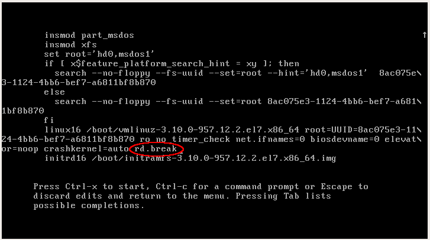

**1. Попасть в систему без пароля несколькими способами**

На экране выборе ядра нажать **e**, чтобы попасть в режим редактирования параметров загрузки:


1.1. ***init=/bin/sh***
В конец строки, начинающиейся с `linux16`, добавляем `rw`, чтобы рутовая фаловая система загрузилась в режиме **Read-Write** (также пришлось удалить срецифичные для Vagrant параметры `console=tty0` и `console=ttyS0,115200n8`):


Меняем пароль рута, создаем файл `/.autorelabel` для обновления меток SELinux и перезагружаемся командой `exec /sbin/init`:


Входим под рутом с новым паролем:


1.2. ***rd.break***
В конец строки, начинающиейся с `linux16`, добавляем `rd.break`(также пришлось удалить срецифичные для Vagrant параметры `console=tty0` и `console=ttyS0,115200n8`):



Попадаем в emergency mode. Далее нужно смонтировать корневую файловую систему `sysroot` в режиме `rw`, сделать в неё `chroot` сменить пароль рута, создать файл  `/.autorelabel` для обновления меток SELinux, выйти из chroot'а и перезагрузиться командой `exit`:


Входим под рутом с новым паролем:


1.2. ***rw init=/sysroot/bin/sh***

Данный способ у меня не заработал на Centos 7, я осуществил его на Centos 8:


**2. Установить систему с LVM, после чего переименовать VG**

2.1. Просмотрим список VG:
```
[vagrant@bootprocess ~]$ sudo -i
[root@bootprocess ~]# vgs
  VG         #PV #LV #SN Attr   VSize   VFree
  VolGroup00   1   2   0 wz--n- <38.97g    0 
```
2.2. Переименуем VG:
```
[root@bootprocess ~]# vgrename VolGroup00 NewRoot
  Volume group "VolGroup00" successfully renamed to "NewRoot"
```
2.3. Теперь необходимо заменить старое имя VG на новое в файлах /etc/fstab, 
/etc/default/grub, /boot/grub2/grub.cfg:
```
[root@bootprocess ~]# sed -i 's/VolGroup00/NewRoot/g' /etc/fstab /etc/default/grub /boot/grub2/grub.cfg
```
2.4. Пересоздадим **initrd image**, чтобы он знал новое имя VG:
```
[root@bootprocess ~]# mkinitrd -f -v /boot/initramfs-$(uname -r).img $(uname -r)
...
*** Creating image file ***
*** Creating image file done ***
*** Creating initramfs image file '/boot/initramfs-3.10.0-862.2.3.el7.x86_64.img' done ***
```
2.5. Перезагрузимся и проверим имя VG:
```
[vagrant@bootprocess ~]$ sudo -i
[root@bootprocess ~]# vgs
  VG      #PV #LV #SN Attr   VSize   VFree
  NewRoot   1   2   0 wz--n- <38.97g    0 
```

**3. Добавить модуль в initrd**

3.1.Скрипты модулей хранятся в каталоге `/usr/lib/dracut/modules.d/`. Для того чтобы добавить свой модуль создаем там папку с именем `mymodule`:

```
[vagrant@bootprocess ~]$ sudo -i
[root@bootprocess ~]# mkdir /usr/lib/dracut/modules.d/01mymodule
```
В нее поместим два скрипта: module-setup.sh - который устанавливает модуль и вызывает скрипт test.sh; test.sh - собственно сам вызываемый скрипт, в нём у нас рисуется пингвинчик. Не забываем сделать файлы скриптов исполняемыми:
```
[root@bootprocess 01mymodule]# chmod +x module-setup.sh test.sh
```

3.2. Пересоберем образ initrd:
```
[root@bootprocess 01mymodule]# dracut -f -v
...
*** Creating image file ***
*** Creating image file done ***
*** Creating initramfs image file '/boot/initramfs-3.10.0-862.2.3.el7.x86_64.img' done ***
```
3.3. Проверим, что наш модуль загрузился в образ `initrd.img`:
```
[root@bootprocess 01mymodule]# lsinitrd -m /boot/initramfs-$(uname -r).img | grep mymodule
mymodule
```
3.4. Из файла `grub.cfg` уберем опции `rghb` и `quiet`, чтобы увидеть вывод при загрузке ОС, и перезагрузимся.


